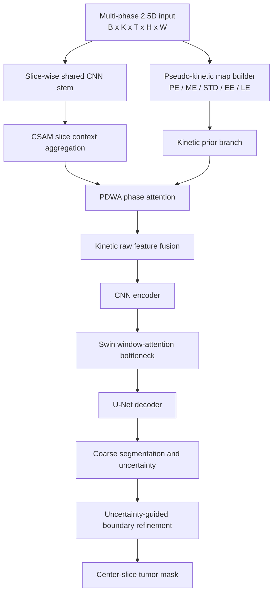

# BreastSeg

面向 BreastDM 乳腺 DCE-MRI 肿瘤分割的 PyTorch 研究代码库。本项目重点研究多时相增强动力学建模，以及在不使用 3D 卷积的前提下利用相邻切片上下文。

当前主线包含：

- **KPTA-Net（2D）**：Pseudo-Kinetic Maps + Pixel-wise Phase Attention + Uncertainty-guided Boundary Refinement。
- **SA-KPTA-Net / KPTA-2.5D（方案 D）**：在 KPTA-Net 基础上增加相邻切片建模、CSAM 跨切片注意力、PDWA 时相差异加权、动力学先验融合和轻量 Swin bottleneck。
- **对比模型复现**：仓库内保留 PDF-UNet 和 MSDAHNet 的 BreastDM 复现实验代码。

> 本仓库仅包含代码和配置，不包含 BreastDM 数据、预处理结果或模型权重。

## 核心思路

BreastDM 每个位置包含平扫、多个增强时相和减影图。项目默认采用以下 17 个 DCE phase/channel：

| 索引 | 内容 |
|---|---|
| `0` | `VIBRANT`，pre-contrast |
| `1..8` | `VIBRANT+C1..C8`，post-contrast phases |
| `9..16` | `SUB1..SUB8`，subtraction phases |

### KPTA-Net（2D）

输入为：

```text
[B, 17, H, W]
```

模型从 pre/post/sub 构造 enhancement、peak、mean、wash-in、wash-out、time-to-peak 和 local contrast 等伪动力学图，并使用像素级时相注意力融合不同增强 phase。Decoder 同时预测分割、边界和不确定性。

### SA-KPTA-Net（2.5D）

默认输入不是 17 个切片，而是：

```text
3 个相邻切片 × 17 个 DCE phase

单样本: [K, T, H, W] = [3, 17, H, W]
batch : [B, K, T, H, W] = [B, 3, 17, H, W]
输出  : [B, 1, H, W]，仅分割中心切片 z
```

其中 `K=3` 对应 `[z-1, z, z+1]`，边界切片采用复制填充：

```text
z = 0     -> [0, 0, 1]
z = Z - 1 -> [Z - 2, Z - 1, Z - 1]
```

模型主流程：



伪动力学图在输入统一归一化之前构造，避免逐 phase 归一化破坏不同增强时相之间的相对强度：

```text
Sub_stack = [SUB1, ..., SUBN]
PE        = max(Sub_stack)
ME        = mean(Sub_stack)
STD       = std(Post1, ..., PostN)
EE        = SUB1
LE        = SUBN
```

## 环境

参考环境：

- Python 3.8
- PyTorch 2.4.1
- CUDA 12.1
- NVIDIA RTX 3090 24 GB

安装依赖：

```bash
conda create -n breastseg python=3.8 -y
conda activate breastseg
pip install -r requirements.txt
```

如需运行仓库中的旧对比实验或可视化脚本，可能还需要安装对应子目录声明的额外依赖。

## 数据目录

预处理脚本期望原始数据已经划分为 `train/val/test`，目录结构如下：

```text
BreastDM/
├── train/
│   ├── images/
│   │   └── patient_x/
│   │       ├── VIBRANT/
│   │       ├── VIBRANT+C1/ ... VIBRANT+C8/
│   │       └── SUB1/ ... SUB8/
│   └── labels/
│       └── patient_x/
│           └── VIBRANT/
├── val/
└── test/
```

`--label_phase` 可改为实际标签所在的 phase 目录，例如 `VIBRANT` 或 `SUB2`。

## 数据预处理

### 2D 17-channel 数据

```bash
python prepare_breastdm_17ch.py \
  --dataset_root /path/to/BreastDM \
  --output_root ./processed_17ch_dce \
  --size 256 \
  --label_phase VIBRANT
```

输出：

```text
processed_17ch_dce/
├── train/
│   ├── data/*.npy    # [H, W, 17]
│   └── GT/*.png      # [H, W]
├── val/
└── test/
```

缺失的 post/sub phase 会被零填充，原始数据不会被覆盖。

### 2.5D 数据

```bash
python prepare_breastdm_25d.py \
  --dataset_root /path/to/BreastDM \
  --output_root ./processed_25d_dce \
  --size 256 \
  --label_phase VIBRANT \
  --num_slices 3
```

输出：

```text
processed_25d_dce/
├── train/
│   ├── data/*.npy    # [3, 17, H, W]
│   └── GT/*.png      # 中心切片标签 [H, W]
├── val/
└── test/
```

`--num_slices` 必须是正奇数。若改为 `5`，需要同时将配置中的 `model.num_slices` 改为 `5`。

## 训练

### 2D KPTA-Net

```bash
python train/train_kpta.py --config configs/kpta_net.yaml
```

### 2.5D SA-KPTA-Net

```bash
python train/train_kpta.py --config configs/kpta_25d_net.yaml
```

训练入口会：

1. 使用 AdamW 和 YAML 中配置的 scheduler。
2. 在验证集 Dice 刷新时保存 `<output_path>/best_model.pth`。
3. 每次刷新 best model 后，以 `eval + inference_mode` 在测试集上评估并输出 `[test_dice]`，不会反向传播。
4. 完成全部 epoch 后重新加载 `best_model.pth` 进行最终测试，而不是使用最后一轮权重。

主要指标为 Dice、IoU、Sensitivity 和 Precision，二值化阈值在训练评估中默认为 `0.5`。

## 配置

核心配置位于：

- `configs/kpta_net.yaml`：2D KPTA-Net。
- `configs/kpta_25d_net.yaml`：完整 2.5D SA-KPTA-Net。
- `configs/kpta_25d_net_*.yaml`：学习率和辅助损失权重实验。

方案 D 的关键参数示例：

```yaml
model:
  in_phases: 17
  num_slices: 3
  base_channels: 32
  slice_attention_type: "csam"
  phase_attention_type: "pdwa"
  use_enhancement_prior: true
  use_kinetic_bias: true
  use_difference_refinement: true
  hybrid_encoder:
    transformer_depth: 2
    window_size: 7
    num_heads: 4

loss:
  bce_weight: 0.5
  lambda_boundary: 0.2
  lambda_uncertainty: 0.1
  lambda_attention_smooth: 0.01
```

## 消融实验

所有创新模块都可以通过命令行关闭，原 YAML 不会被修改：

```bash
# 不使用伪动力学图
python train/train_kpta.py --config configs/kpta_25d_net.yaml \
  --disable_kinetic_maps

# 不使用跨切片上下文
python train/train_kpta.py --config configs/kpta_25d_net.yaml \
  --disable_slice_context

# 不使用时相注意力
python train/train_kpta.py --config configs/kpta_25d_net.yaml \
  --disable_pixelwise_phase_attention

# 不使用动力学原始特征融合
python train/train_kpta.py --config configs/kpta_25d_net.yaml \
  --disable_kinetic_raw_fusion

# 不使用 Swin bottleneck
python train/train_kpta.py --config configs/kpta_25d_net.yaml \
  --disable_transformer_bottleneck

# 不使用不确定性边界细化
python train/train_kpta.py --config configs/kpta_25d_net.yaml \
  --disable_uncertainty_refinement

# 不使用边界辅助头
python train/train_kpta.py --config configs/kpta_25d_net.yaml \
  --disable_boundary_head

# 不使用 attention smoothness loss
python train/train_kpta.py --config configs/kpta_25d_net.yaml \
  --disable_attention_smooth_loss
```

## 测试与可视化

训练完成后，使用验证集最优权重生成测试集预测、概率图和可视化结果：

```bash
python visualize_kpta_25d_test.py \
  --config configs/kpta_25d_net.yaml \
  --checkpoint results_kpta_25d_net/best_model.pth \
  --threshold 0.5
```

如不传 `--checkpoint`，脚本默认读取 YAML 中：

```text
<train.output_path>/best_model.pth
```

输出默认保存在：

```text
<train.output_path>/test_visualization/
├── masks/
├── probabilities/
├── visualizations/
├── metrics.csv
└── summary.txt
```

验证集可视化脚本：

```bash
python visualize_kpta_25d_val.py \
  --config configs/kpta_25d_net.yaml \
  --checkpoint results_kpta_25d_net/best_model.pth
```

## Sanity Checks

```bash
python tests/sanity_kpta_net.py
python tests/sanity_kpta_25d_net.py
```

测试覆盖：

- 2D 和 2.5D 前向传播。
- 单 post 与完整 17-phase 输入。
- 输出形状和 NaN/Inf 检查。
- phase attention 权重和为 1。
- CSAM、PDWA 和 pixel-wise attention 路径。
- loss backward。
- 空 mask 和主要消融开关。
- 2.5D 首尾切片索引填充。

## 项目结构

```text
BreastSeg/
├── configs/                    # KPTA/SA-KPTA 配置与调参实验
├── model/
│   ├── kpta_net.py             # 2D KPTA-Net
│   ├── kpta_25d_net.py         # 2.5D SA-KPTA-Net
│   ├── kpta_blocks.py          # 共享网络模块
│   └── kpta_utils.py           # phase 解析与 kinetic map 工具
├── train/
│   ├── train_kpta.py           # 配置驱动训练/验证/测试入口
│   ├── train_config.py         # 模型和损失 factory
│   └── losses.py               # 分割、边界、不确定性和注意力损失
├── tests/                      # CPU-friendly sanity checks
├── prepare_breastdm_17ch.py    # 2D 17-channel 数据构建
├── prepare_breastdm_25d.py     # 2.5D 数据构建
├── visualize_kpta_25d_val.py   # 验证集可视化
├── visualize_kpta_25d_test.py  # 测试集推理与可视化
├── PDF-UNet-main/              # PDF-UNet 对比实验
└── Multi-Scale-Dual-Attention-Hybrid-Convolution-Network-main/
                                  # MSDAHNet 对比实验
```

## 训练注意事项

- `model.in_phases` 必须与 `.npy` 的 `T` 一致。
- `model.num_slices` 必须与 2.5D 数据的 `K` 一致。
- kinetic maps 必须先基于原始/预处理强度构造，再统一归一化。
- `processed_17ch_dce/`、`processed_25d_dce/`、权重和结果目录已在 `.gitignore` 中排除。
- 当前训练入口会在每次验证集最优时查看测试集指标。严格论文评估中，建议只用验证集选择模型，并在全部实验确定后对测试集执行一次最终评估，以避免测试集信息泄漏。

## License

本仓库沿用根目录 [LICENSE](LICENSE) 中的 MIT License。第三方模型目录可能包含各自的许可和引用要求，使用前请分别核对。
